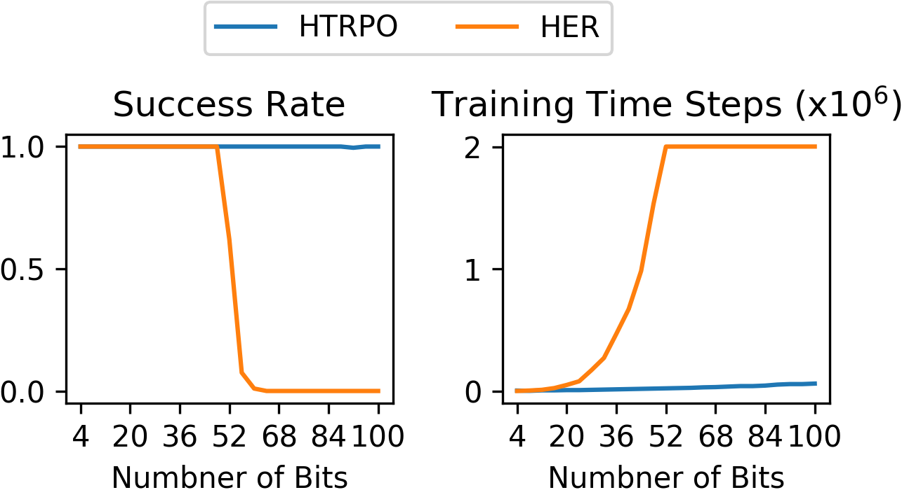
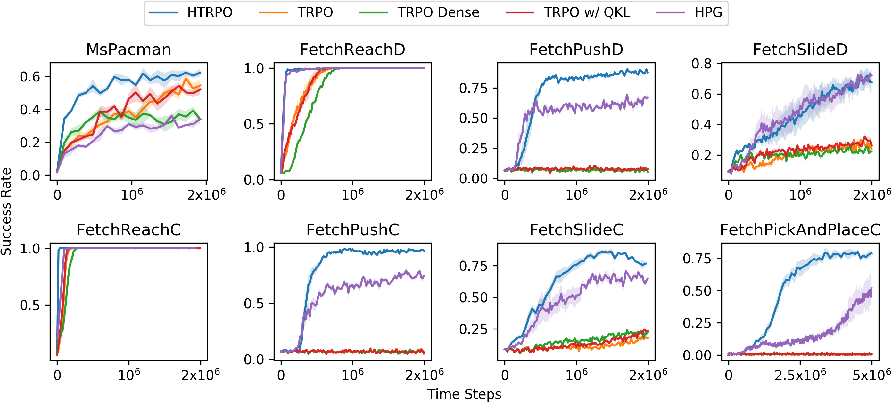

# Hindsight Trust Region Policy Optimization

## Log
[04/06/2020] A new version of HTRPO with much higher performance especially in Discrete Robotic Control Tasks.

[25/03/2020] Fix some bugs.

[08/03/2020] Fix some bugs including the failing of first update.

## Introduction

This is a deep reinforcement learning package including our newly proposed algorithm **Hindsight Trust Region Policy Optimization**.

### Demo Video

A demo video is in demo/ which shows how our algorithm works.

### Requirements

python               3.4

torch                1.1.0

numpy                1.16.2

gym                  0.12.1

tensorboardX         1.7

mujoco-py            2.0.2.2

Please make sure that the versions of all the requirements match the ones above, which is necessary for running the code.

### Examples
For running continuous envs (e.g. FetchPush-v1) with HTRPO algorithm:
```bash
python main.py --alg HTRPO --env FetchPush-v1 --num_steps 2000000 --num_evals 200 --eval_interval 19200 (--cpu)
```

For running discrete envs (e.g. FlipBit8):

```bash
python main.py --alg HTRPO --env FlipBit8 --unnormobs --num_steps 50000 --num_evals 200 --eval_interval 1024 (--cpu)
```

--cpu is used only when you want to train the policy using CPU, which will be much slower than using GPU.

--unnormobs is used when you do not want to do input normalization. In our paper, all the discrete envs do not use this trick at all.

**Note**: 

We propose HTRPO for sparse reward reinforcement learning, and as baselines, TRPO and HPG for sparse reward are also implemented. To run HTRPO, you need to follow the above instruction. To run HPG, you only need to modify the hyperparameter "using_hpg" to "True" in the corresponding config file (e.g. for FetchPush-v1, the config file is configs/HTRPO_FetchPushv1.py). To run TRPO, you need to modify the hyperparameter "sampled_goal_num" to 0 and "using_original_data" to "True", which means that the policy will be trained using only the original collected data without any modification.

### Environment List

Discrete: FlipBit8, FlipBit16, EmptyMaze, FourRoomMaze, MsPacman, FetchReachDiscrete, FetchPushDiscrete, FetchSlideDiscrete

Continuous: FetchReach-v1, FetchPush-v1, FetchSlide-v1, FetchPickAndPlace-v1

All the listed names can be directly used in command line for training policies.

#### FlipBit

|  |
|:---:|
| FlipBit results|

To run FilpBit experiments (here 32 bits flipping is taken as an example):

```bash
python main.py --alg HTRPO --env FlipBit32 --num_steps 2000000 --num_evals 200 --eval_interval 1024 (--cpu)
```

#### Comparison with Baselines

|  |
|:---:|
| Comparison results|

To run these experiments (here 32 bits flipping is taken as an example):

```bash
python main.py --alg HTRPO --env FetchPush-v1 --num_steps 2000000 --num_evals 200 --eval_interval 19200 (--cpu)
```

### Paper
This work is submitted to Thirty-fourth Conference on Neural Information Processing Systems named Hindsight Trust Region Policy Optimization.
